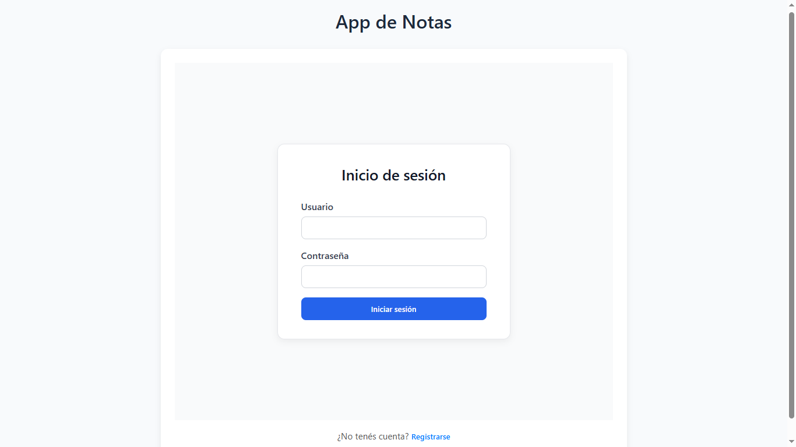
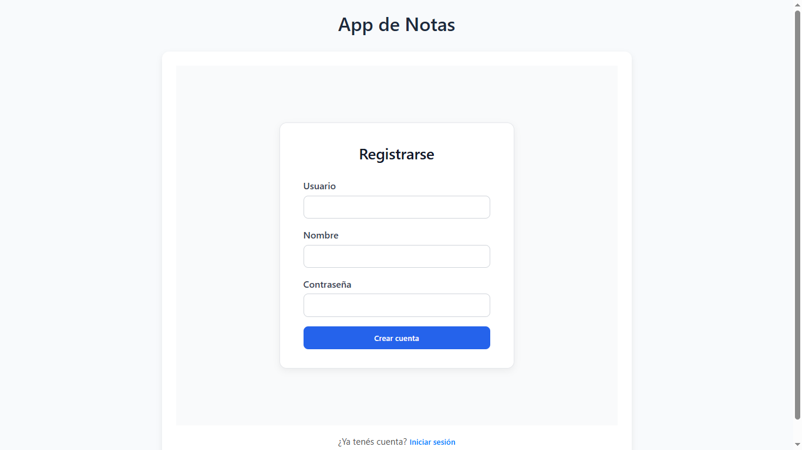
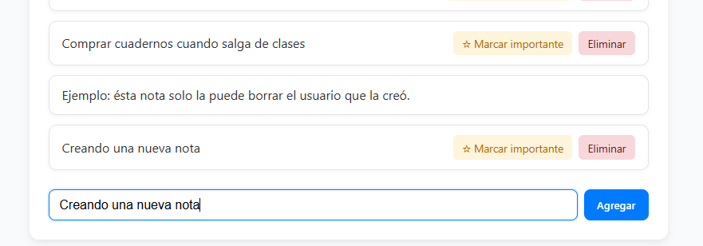
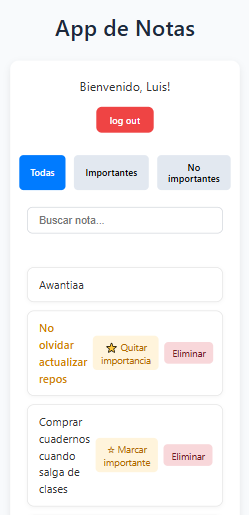
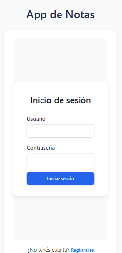

# 📝 Notas App

Aplicación de notas con autenticación, persistencia en MongoDB y una interfaz simple para crear, editar y marcar notas como importantes.
Desarrollada con **React + Redux** en el frontend y **Node.js + Express + MongoDB Atlas** en el backend.

---

## 🏷️ Badges


---

## 🚀 Características

- Crear nuevas notas con título y contenido
- Editar y eliminar notas existentes
- Filtrar o buscar notas
- Persistencia mediante un backend con API REST
- Interfaz responsive y sencilla

---

## 🧠 Tecnologías

### Frontend

- React
- Vite
- Redux
- CSS Modules
- Axios para comunicación con la API

### Backend

- Node.js + Express
- MongoDB Atlas para la base de datos
- CORS y middlewares básicos

---

## ✨ Funcionalidades

- Registro e inicio de sesión
- Crear nuevas notas
- Marcar notas como importantes
- Editar notas existentes
- Ver solo notas importantes
- Eliminar notas

## ⚙️ Instalación y ejecución

### 1. Clonar el repositorio

```
    git clone https://github.com/tu-usuario/notas-app.git
    cd notas-app
```

### 2. Instalar dependencias

**Backend**

```
    cd backend
    npm install
    npm run dev
```

Por defecto se ejecuta en `http://localhost:3001` (ajustar si es necesario).

**Frontend**

```
    cd frontend
    npm install
    npm run dev
```

Por defecto se ejecuta en `http://localhost:5173` (o el puerto que indique Vite).

---

## 🔗 Comunicación entre frontend y backend

El frontend se comunica con el backend a través de peticiones HTTP.  
Asegúrate de que la **URL base del backend** esté configurada correctamente  
en los archivos del frontend (por ejemplo, en `services/notes.js`).

---

## ⚙️ Configurar variables de entorno

En el backend, crea un archivo `.env` con la siguiente información:

```
    MONGODB_URI=tu_conexion_a_mongodb_atlas
    PORT=3001
```

---

## 🧰 Scripts útiles

| Comando         | Descripción                                      |
| --------------- | ------------------------------------------------ |
| `npm run dev`   | Inicia el servidor o frontend en modo desarrollo |
| `npm run build` | Genera la versión optimizada del frontend        |
| `npm start`     | Ejecuta el backend en modo producción            |

---

## 📂 Estructura del proyecto

```
    notas-app/
    │
    ├── backend/
    │   ├── controllers/
    │   ├── models/
    │   ├── tests/
    │   ├── utils/
    │   ├── app.js
    │   ├── index.js
    │   └── ...
    │
    ├── frontend/
    │   ├── tests/
    │   │   ├── mocks/
    │   │   ├── e2e/
    │   │   └── unit/
    │   ├── src/
    │   │   ├── components/
    │   │   ├── features/
    │   │   ├── services/
    │   │   ├── store.js
    │   │   ├── main.jsx
    │   │   └── App.jsx
    │   ├── index.html
    │   └── ...
    │
    └── README.md
```

---

## 📸 Capturas

### Login



### Register



### Dashboard principal


### Agregar gasto



### Vista móvil (opcional)




---

## 🧪 Testing

Backend:

- Pruebas unitarias
- Pruebas de integración con Supertest

  Comando:

```
npm test
```

Para iniciar una db alterna de pruebas para e2e:

```
npm run start:test
```

Frontend:

- Unitarias:

```
npm test
```

- E2E con Playwright:

```
npx playwright test
npx playwright test --ui (modo gráfico)
```

Cubre:

- Crear gasto
- Editar gasto
- Eliminar gasto
- Login
- Persistencia visual

---

## 🧩 Futuras mejoras

- Categorías o etiquetas para las notas
- Modo oscuro
- Edición del contenido de las notas

---

## 📜 Licencia

Este proyecto está bajo la licencia MIT — ver el archivo LICENSE para más detalles.

## 👨‍💻 Autor

Desarrollado por **Luis Gutiérrez**  
📧 [luis.gut.11jm@gmail.com]  
🔗 [https://github.com/luisgutierrez11]
